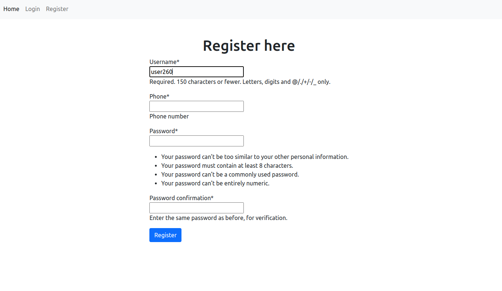
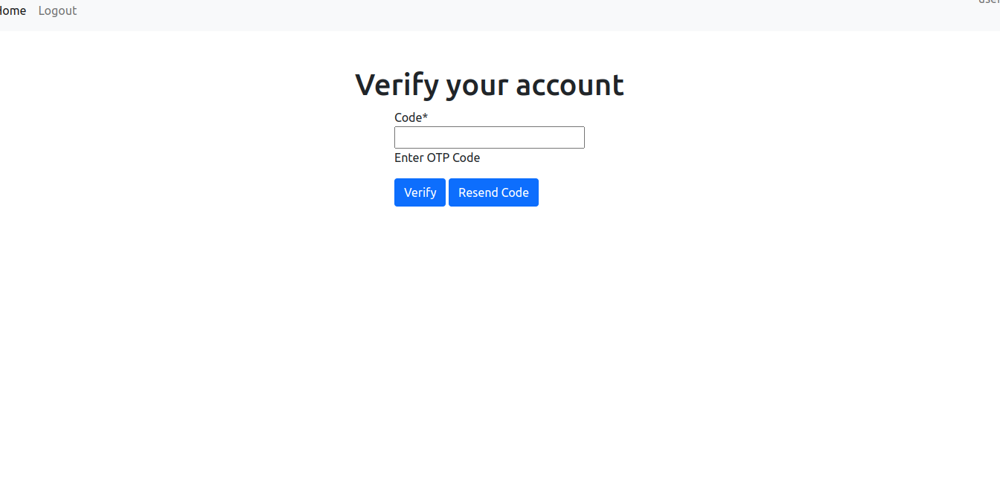
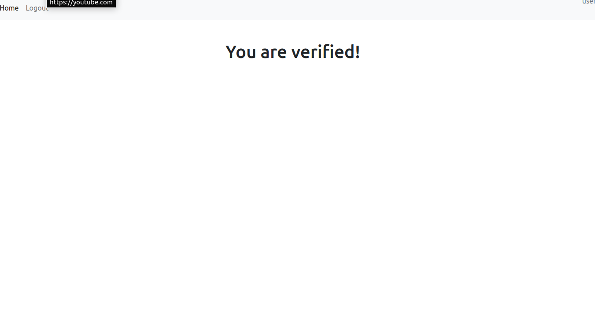
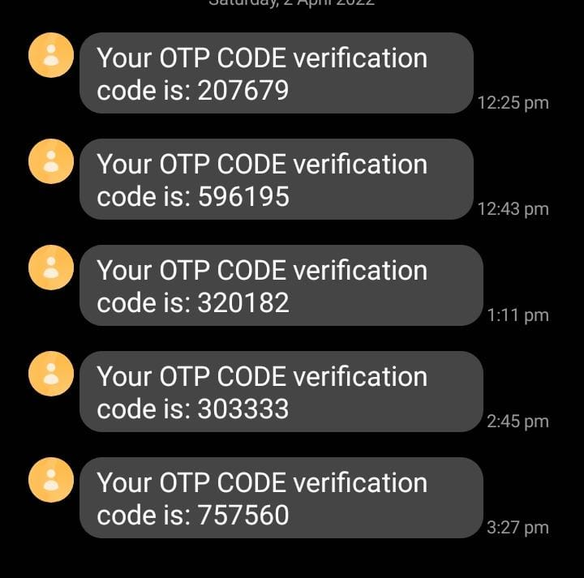

# OTP-AUTHENTICATION APP

##### This is a django login and registration web application that uses twilio to send OTP code to verify users before giving them access to the mail page

##### This webpage is hosted on heroku. Link [OTP-AUTHENTICATION](https://otp-auth-app.herokuapp.com/)

##### These are the screenshots to the webpages and flow of the app

##### Registration page

##### Login Page

##### Verify using OTP page

##### Verified page

##### otp code page
